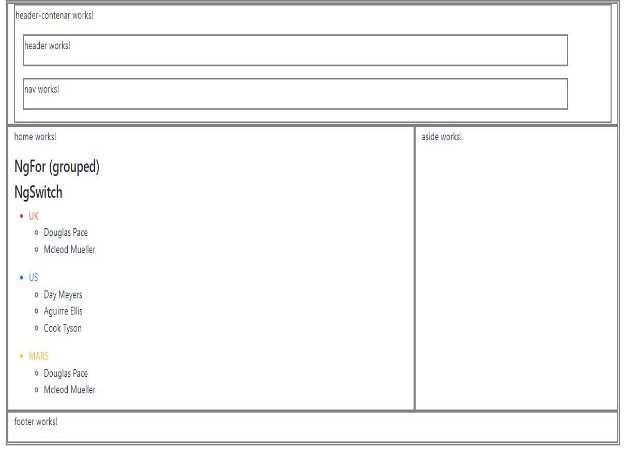

# Object Task

1-  Use this object in home component  

1. peopleByCountry: any[] = [ { 'country': 'UK', 'people': [ { "name": "Douglas Pace" }, { "name": "Mcleod Mueller" }, ] }, 

   `   `{ 'country': 'US', 'people': [ { "name": "Day Meyers" }, { "name": "Aguirre Ellis" }, { "name": "Cook Tyson" } ] }, 

   `   `{ 'country': 'MARS', 'people': [ { "name": "Douglas Pace" }, { "name": "Mcleod Mueller" }, ] } ]; 

2. use for loop to print country  in \<ul> \<li> 
2. use switch case to color country  
2. for every country print people in  \<ul> \<li>   

